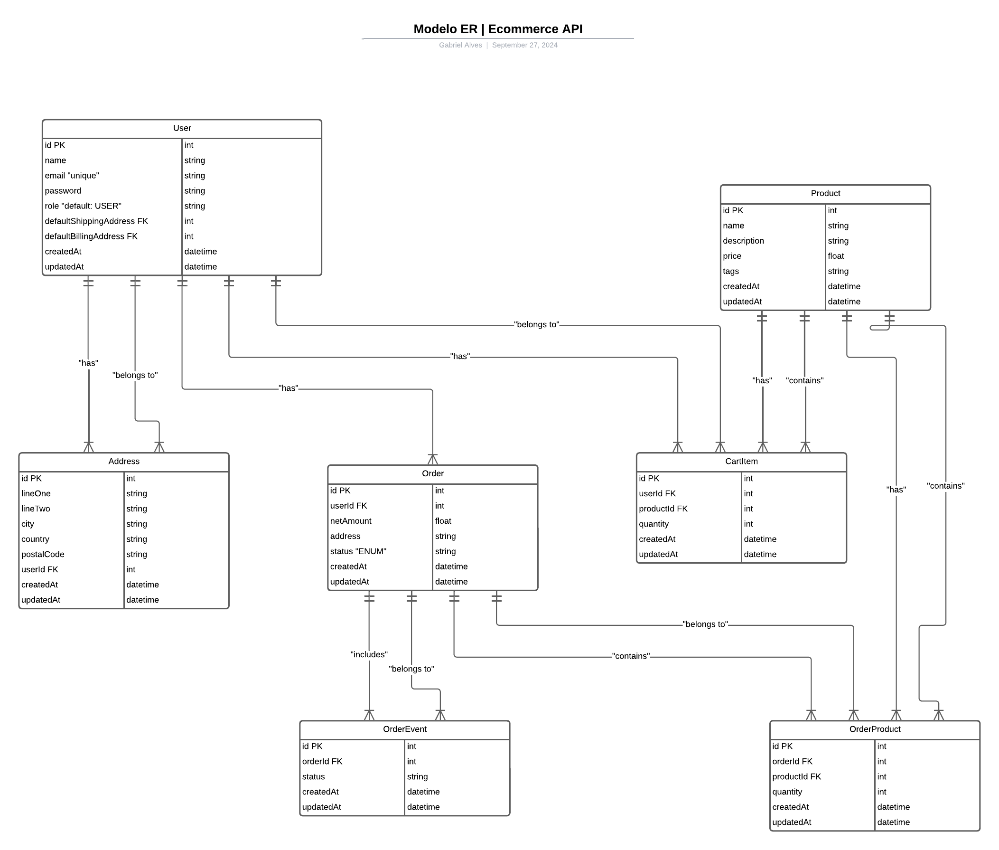
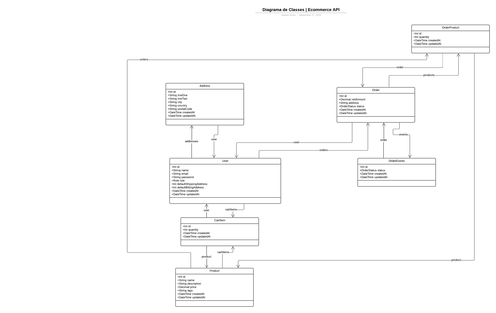

# E-commerce API

Este projeto consiste em uma API para e-commerce construída utilizando **Node.js**, **Express**, **TypeScript**, **Prisma ORM** e **PostgreSQL**. A aplicação também conta com um front-end simples desenvolvido em **Vue.js**. A API abrange funcionalidades para gerenciamento de usuários, autenticação, produtos, carrinho de compras e pedidos.

## Tecnologias Utilizadas

- **Node.js**: Plataforma de execução JavaScript para desenvolvimento no lado do servidor.
- **Express**: Framework web para Node.js.
- **TypeScript**: Superset do JavaScript com suporte a tipagem estática.
- **Prisma ORM**: ORM que facilita a interação com o banco de dados PostgreSQL.
- **PostgreSQL**: Sistema de banco de dados relacional utilizado para armazenar as informações.
- **Vue.js**: Framework JavaScript usado para a criação do front-end.
- **Docker**: Utilizado para configurar o ambiente de desenvolvimento com containers.

## Funcionalidades

### Autenticação

- **POST /auth/signup**: Cadastro de um novo usuário.
- **POST /auth/login**: Login de um usuário existente.
- **GET /auth/me**: Obter informações do usuário autenticado.

### Usuários

- **GET /users**: Listar todos os usuários (somente Admin).
- **GET /users/{id}**: Obter detalhes de um usuário (somente Admin).
- **PUT /users/{id}/role**: Alterar o papel de um usuário (somente Admin).
- **PUT /users**: Atualizar as informações do usuário autenticado.
- **DELETE /users/address/{id}**: Remover um endereço de um usuário autenticado.
- **GET /users/address**: Listar endereços do usuário autenticado.
- **POST /users/address**: Adicionar um novo endereço para o usuário autenticado.

### Produtos

- **POST /products**: Criar um novo produto (somente Admin).
- **GET /products**: Listar todos os produtos disponíveis.
- **GET /products/{id}**: Obter os detalhes de um produto.
- **PUT /products/{id}**: Atualizar um produto existente (somente Admin).
- **DELETE /products/{id}**: Excluir um produto (somente Admin).

### Carrinho de Compras

- **POST /carts**: Adicionar um item ao carrinho.
- **GET /carts**: Obter os itens do carrinho do usuário autenticado.
- **DELETE /carts/{id}**: Remover um item do carrinho.
- **PUT /carts/{id}**: Alterar a quantidade de um item no carrinho.

### Pedidos

- **POST /orders**: Criar um novo pedido.
- **GET /orders**: Listar os pedidos do usuário autenticado.
- **GET /orders/{id}**: Obter detalhes de um pedido específico.
- **PUT /orders/{id}/cancel**: Cancelar um pedido.
- **GET /orders/index**: Listar todos os pedidos (somente Admin).
- **PUT /orders/{id}/status**: Alterar o status de um pedido (somente Admin).
- **GET /orders/users/{userId}**: Listar todos os pedidos de um usuário específico (somente Admin).

## Instalação e Execução

### Pré-requisitos

**Docker** e **Docker Compose** instalados.

### Passos para rodar a aplicação

1. Clone o repositório:

   ```bash
   git clone https://github.com/seu-usuario/seu-repositorio.git
   ```

2. Configure o arquivo `.env` com as variáveis de ambiente necessárias, como a URL do banco de dados:

   ```env
   DATABASE_URL=postgresql://postgres:password@db:5432/mydatabase
   ```

3. Execute o Docker Compose para levantar os containers:

   ```bash
   docker-compose up --build
   ```

4. Acesse a API no endereço [http://localhost:3000/api](http://localhost:3000/api).

5. O front-end estará disponível em [http://localhost:5173](http://localhost:5173).

### Prisma

- Para aplicar as migrações e sincronizar o esquema do banco de dados com o Prisma, execute:

  ```bash
  npx prisma migrate dev
  ```

- Para acessar o **Prisma Studio**, utilize:

  ```bash
  npx prisma studio
  ```

## Estrutura do Projeto

- **backend/**: Contém o código-fonte da API.
- **frontend/**: Diretório do front-end Vue.js.

- **docker-compose.yml**: Arquivo de configuração para orquestrar os containers Docker.

## Diagrama ER

Abaixo está o diagrama de entidade-relacionamento (ER) do banco de dados utilizado na API. Ele mostra as tabelas, suas relações e as colunas principais.



## Diagrama de Classes

O diagrama de classes ilustra a estrutura das entidades no código e suas interações no nível de aplicação.


